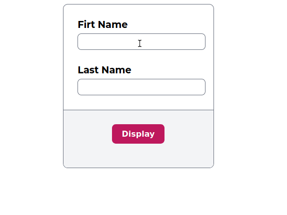

## Working with forms and event listeners

### Descriptiom
A task to accept user inputs and on click of the button display a welcome message using addEventListener()

### Demo

    

### Author
[Adithya Mallya@1NT18IS013](https://github.com/1NT18IS013/1NT18IS013_adithya_B_jsLab)

### Date
09/04/2021

