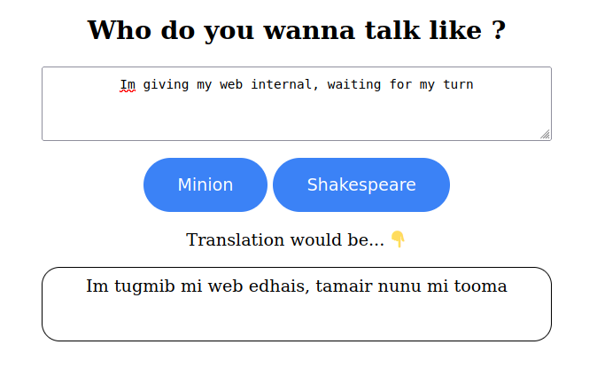
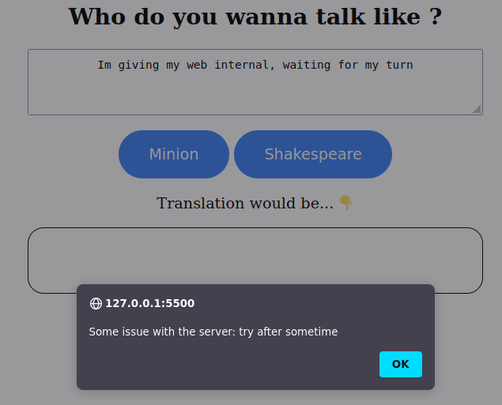

# Internal

> Date : 10/07/21

```
Question :

Create an app to demonstrate the fetch URI from at least two different servers on the same page.
```
### Description 
Made a fun translator app, that can translate you english text to either  _Minion_ or _Shakespearean_ language.

### Demo


Translation in minion :



Error response when server is down/ limit exceeds




### API reference

[1. Minion translator API](https://funtranslations.com/api/minion) 

[2. Shakespeare translator API](https://funtranslations.com/api/shakespeare)